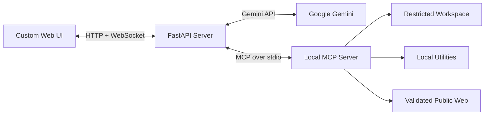

<div align="center">
  

# OmniMCP

**A secure, local AI workspace powered by Gemini and the Model Context Protocol.**

Chat with an AI agent that can inspect files, manage workspace content, use local
utilities, and retrieve public web pages through a controlled tool boundary.

[](https://www.python.org/)
[](https://fastapi.tiangolo.com/)
[](https://modelcontextprotocol.io/)
[](LICENSE)
</div>

---

## What Is OmniMCP?

OmniMCP is a self hosted AI assistant built for people who want useful local
automation without giving an agent unrestricted access to their machine.

It combines a responsive custom web interface, a FastAPI application server,
Google Gemini, and an isolated MCP tool process. Filesystem operations are
restricted to one configured workspace, destructive actions require explicit
approval, and authenticated sessions remain on the server.

The interface is implemented with plain HTML,
CSS, and JavaScript so it remains lightweight and easy to customize.

## Highlights

- **Local workspace**: File tools cannot leave the configured `FILES_PATH`.
- **Controlled agent actions**: Writes, deletions, and todo clearing require
  browser approval before execution.
- **Modern chat interface**: Responsive navigation, collapsible context panel,
  archived conversations, syntax friendly responses, and tool activity.
- **Dark, light, and system themes**: Theme preferences persist in the browser.
- **Conversation management**: Rename, delete, archive, and export conversations
  as Markdown and JSON inside a ZIP file.
- **Secure authentication**: Signed HTTP-only cookies, login throttling,
  same-origin validation, and salted PBKDF2 password hashes.
- **Safer web access**: Public HTTP and HTTPS retrieval with redirect limits,
  response-size limits, private-network blocking, and DNS pinning.
- **No frontend build step**: Run the FastAPI server and open the application.

## Interface

The application is organized around three focused areas:

1. **Workspace sidebar** for conversations, settings, export, and account actions.
2. **Conversation stage** for messages, Markdown responses, code, and tool status.
3. **Context panel** for model state, available tools, and active agent work.

The layout adapts to desktop, tablet, and mobile screens. On smaller displays,
the navigation and context panels become dismissible drawers.

## Included Tools

| Tool                | Capability                                              |
|---------------------|---------------------------------------------------------|
| `get_current_time`  | Return the server's local date, time, and timezone      |
| `get_system_info`   | Inspect basic OS, CPU, memory, and workspace disk usage |
| `list_directory`    | List files and directories inside the workspace         |
| `read_file`         | Read a size-limited UTF-8 text file                     |
| `write_file`        | Create or overwrite a workspace file after approval     |
| `delete_path`       | Delete a workspace file or directory after approval     |
| `search_in_files`   | Search text across workspace files                      |
| `add_todo`          | Add an item to the workspace todo list                  |
| `list_todos`        | Display the current todo list                           |
| `clear_todos`       | Clear the todo list after approval                      |
| `fetch_web_summary` | Extract readable text from a public HTTP or HTTPS page  |

## Architecture



Each authenticated application session receives its own Gemini history and MCP
client session. The MCP server runs as a separate child process and exposes only
the tools defined in `mcp_tools.py`.

## Getting Started

### Prerequisites

- Python 3.10 or newer
- A [Google Gemini API key](https://aistudio.google.com/app/api-keys)
- Internet access for Gemini and optional public web retrieval

### 1. Clone the repository

```bash
git clone https://github.com/meharehsaan/OmniMCP.git
cd OmniMCP
```

### 2. Create a virtual environment

```bash
python3 -m venv .venv
source .venv/bin/activate
```

On Windows PowerShell:

```powershell
.venv\Scripts\Activate.ps1
```

### 3. Install dependencies

```bash
python3 -m pip install --upgrade pip
python3 -m pip install -r requirements.txt
```

### 4. Configure the environment

```bash
cp .env.example .env
python3 -c "import secrets; print(secrets.token_hex(32))"
```

Add the generated value as `AUTH_SECRET`, then configure `.env`:

```env
OMNIMCP_USER=admin
PASSWORD=use-a-strong-password-of-10-or-more-characters
AUTH_SECRET=your-generated-random-secret

GEMINI_MODEL_ID=gemini-3.5-flash
GEMINI_API_KEY=your-gemini-api-key

FILES_PATH=./workspace
COOKIE_SECURE=false
```

### 5. Start OmniMCP

```bash
python3 -m uvicorn app:app --host 127.0.0.1 --port 8000
```

Open [http://127.0.0.1:8000](http://127.0.0.1:8000) and sign in using the
credentials from `.env`.

For development with automatic reload:

```bash
python3 -m uvicorn app:app --host 127.0.0.1 --port 8000 --reload
```

## Security Model

OmniMCP is designed for local use and applies several defensive controls:

- Session identifiers are random, HMAC-signed, HTTP-only, and `SameSite=Strict`.
- Login attempts are rate-limited by client address.
- State-changing HTTP requests and WebSockets are checked for same-origin use.
- Password changes are stored as salted PBKDF2 hashes with restricted file
  permissions and invalidate other active sessions.
- Filesystem paths are resolved and checked against `FILES_PATH`, including
  symlink-aware deletion handling.
- Destructive or modifying tools require explicit confirmation in the browser.
- Web retrieval rejects credentials in URLs, non-HTTP schemes, private and
  reserved addresses, oversized responses, and excessive redirects.
- Security headers include CSP, frame protection, MIME sniffing protection, and
  a restrictive permissions policy.

For local use, keep the server bound to `127.0.0.1`. If you expose OmniMCP to a
network, place it behind a properly configured HTTPS reverse proxy and set:

```env
COOKIE_SECURE=true
```

## Password Management

The password in `.env` is used until it is changed from **Settings**. After a
change, OmniMCP stores only a salted hash in `.omnimcp_auth.json`.

To deliberately restore the password from `.env`, stop the server and remove
`.omnimcp_auth.json` before starting it again.

## Project Structure

```text
OmniMCP/
├── app.py                 # FastAPI app, authentication, sessions, and Gemini loop
├── config.py              # Environment configuration and validation
├── mcp_tools.py           # Isolated local MCP tool server
├── public/
│   ├── index.html         # Application markup
│   ├── app.js             # Chat, WebSocket, settings, and conversation behavior
│   ├── styles.css         # Responsive dark/light interface
│   └── logo_mark.svg      # Application mark
├── utils/
│   └── logger.py          # Console and rotating file logging
├── .env.example           # Safe configuration template
└── requirements.txt       # Python dependencies
```

## Contributing

Issues and pull requests are welcome. Keep changes focused, preserve the local
security boundary, and include verification steps for behavior that touches
authentication, filesystem access, web retrieval, or tool execution.

For larger changes, open an issue first to describe the use case and proposed
approach.

## License

OmniMCP is available under the [MIT License](LICENSE).

Built with ❤️ by [Ehsaan Mehar](https://github.com/meharehsaan)
